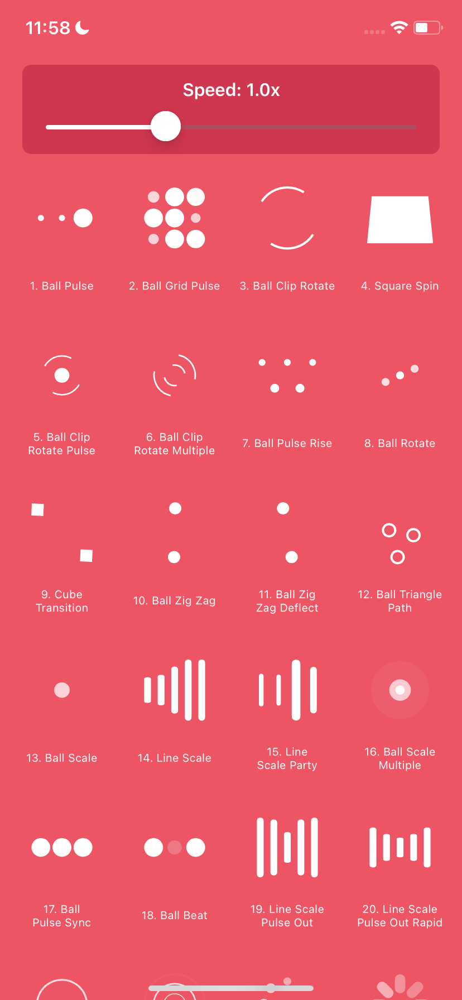

# NVActivityIndicatorView-ObjC

<div align="center">
  
</div>

[](https://cocoapods.org/pods/NVActivityIndicatorView-ObjC)
[](https://cocoapods.org/pods/NVActivityIndicatorView-ObjC)
[](https://cocoapods.org/pods/NVActivityIndicatorView-ObjC)

> **Note**: This library is a complete 1:1 Objective-C port of the original Swift [NVActivityIndicatorView](https://github.com/ninjaprox/NVActivityIndicatorView) library. All animations and functionality have been faithfully recreated for Objective-C projects.

## Description

NVActivityIndicatorView-ObjC is a collection of awesome loading animations for iOS applications written in Objective-C. It provides 30+ different types of loading indicators with customizable colors, sizes, and animation speeds.

## Features

- ✅ **30+ Beautiful Animations**: A wide variety of loading indicators to choose from
- ✅ **Customizable**: Easy to customize colors, sizes, and animation speeds
- ✅ **Lightweight**: Minimal impact on your app's performance
- ✅ **Easy Integration**: Simple API for quick implementation
- ✅ **Speed Control**: Dynamic animation speed adjustment
- ✅ **iOS 9.0+**: Supports iOS 9.0 and above

## Animation Types

The library includes the following animation types:

- BallPulse
- BallGridPulse
- BallClipRotate
- SquareSpin
- BallClipRotatePulse
- BallClipRotateMultiple
- BallPulseRise
- BallRotate
- CubeTransition
- BallZigZag
- BallZigZagDeflect
- BallTrianglePath
- BallScale
- LineScale
- LineScaleParty
- BallScaleMultiple
- BallPulseSync
- BallBeat
- LineScalePulseOut
- LineScalePulseOutRapid
- BallScaleRipple
- BallScaleRippleMultiple
- BallSpinFadeLoader
- LineSpinFadeLoader
- TriangleSkewSpin
- Pacman
- BallGridBeat
- SemiCircleSpin
- BallRotateChase
- Orbit
- AudioEqualizer
- CircleStrokeSpin
- BallDoubleBounce

## Example

To run the example project, clone the repo, and run `pod install` from the Example directory first.

```bash
git clone https://github.com/maitrungduc1410/NVActivityIndicatorView.git
cd NVActivityIndicatorView/Example
pod install
open NVActivityIndicatorView.xcworkspace
```

## Installation

NVActivityIndicatorView-ObjC is available through [CocoaPods](https://cocoapods.org). To install it, simply add the following line to your Podfile:

```ruby
pod 'NVActivityIndicatorView-ObjC'
```

## Usage

### Basic Usage

```objc
#import <NVActivityIndicatorView_ObjC/NVActivityIndicatorView.h>

// Create an activity indicator
NVActivityIndicatorView *activityIndicatorView = [[NVActivityIndicatorView alloc]
    initWithFrame:CGRectMake(0, 0, 40, 40)
             type:NVActivityIndicatorTypeBallPulse
            color:[UIColor blueColor]
          padding:0];

// Add to your view
[self.view addSubview:activityIndicatorView];
```

### Advanced Usage with Speed Control

```objc
// Create with custom animation speed
NVActivityIndicatorView *activityIndicatorView = [[NVActivityIndicatorView alloc]
    initWithFrame:CGRectMake(0, 0, 40, 40)
             type:NVActivityIndicatorTypeBallPulse
            color:[UIColor redColor]
          padding:0];

// Set animation speed (1.0 = normal, 2.0 = 2x faster, 0.5 = 2x slower)
activityIndicatorView.animationSpeedMultiplier = 1.5;

[self.view addSubview:activityIndicatorView];
```

## Credits

This library is a complete Objective-C port of the original Swift [NVActivityIndicatorView](https://github.com/ninjaprox/NVActivityIndicatorView) by [Vinh Nguyen](https://github.com/ninjaprox). All credit for the original animations and design goes to the original author.

## License

NVActivityIndicatorView-ObjC is available under the MIT license. See the LICENSE file for more info.
